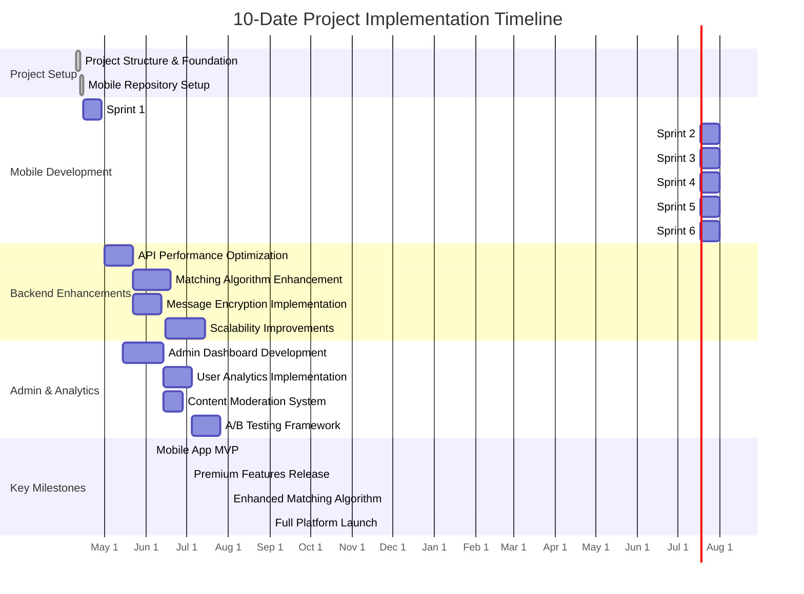
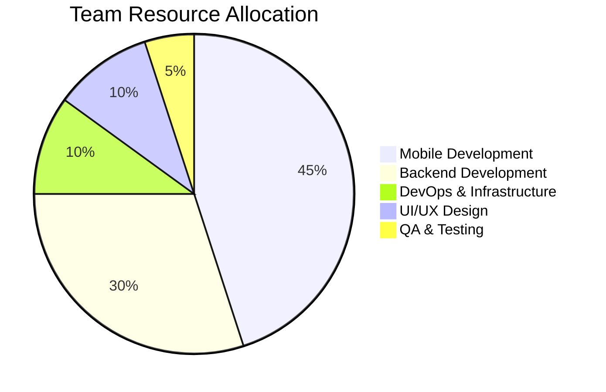
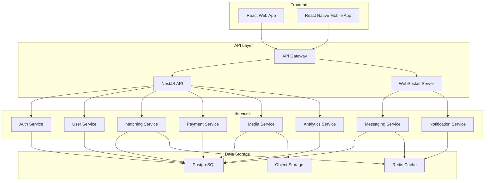
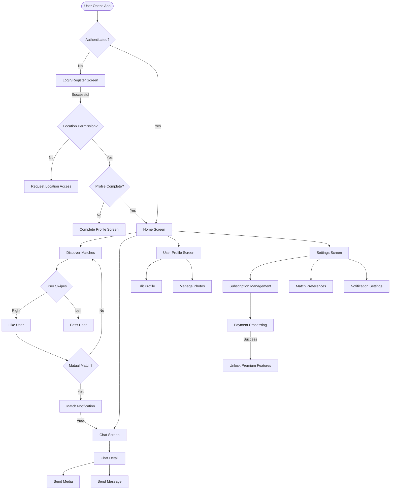
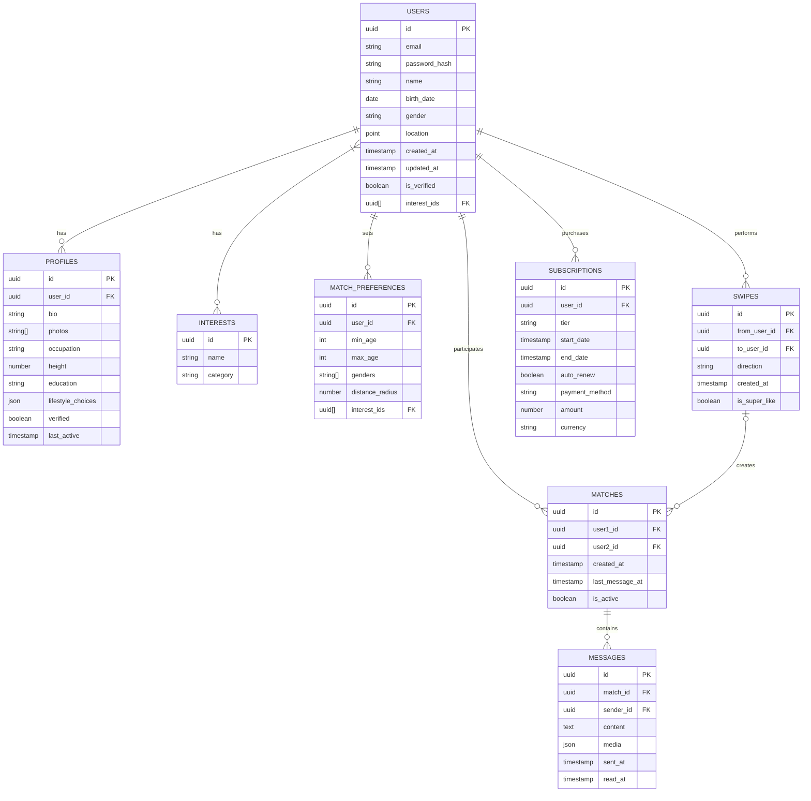

# 10-Date Launch Timeline



## Development Team Allocation



## Feature Implementation Priority Matrix

```mermaid
quadrantChart
    title Feature Priority Matrix
    x-axis Impact: Low to High
    y-axis Effort: Low to High
    quadrant-1 High Impact, Low Effort
    quadrant-2 High Impact, High Effort
    quadrant-3 Low Impact, Low Effort
    quadrant-4 Low Impact, High Effort
    
    "Authentication": [0.9, 0.3]
    "Matching Algorithm": [0.95, 0.9]
    "Chat": [0.8, 0.7]
    "Profile Management": [0.6, 0.4]
    "Subscription System": [0.9, 0.6]
    "Moderation Tools": [0.5, 0.7]
    "Analytics Dashboard": [0.5, 0.5]
    "Notifications": [0.7, 0.3]
    "AI Recommendations": [0.8, 0.9]
    "Geolocation": [0.7, 0.4]
```

## Tech Stack Architecture



## User Journey Flow



## Database Schema Overview



This comprehensive roadmap provides a visual representation of the 10-Date project implementation plan, including timelines, team allocation, feature priorities, tech stack architecture, user journey flow, and database schema. These diagrams will help the development team understand the overall project structure and dependencies.
