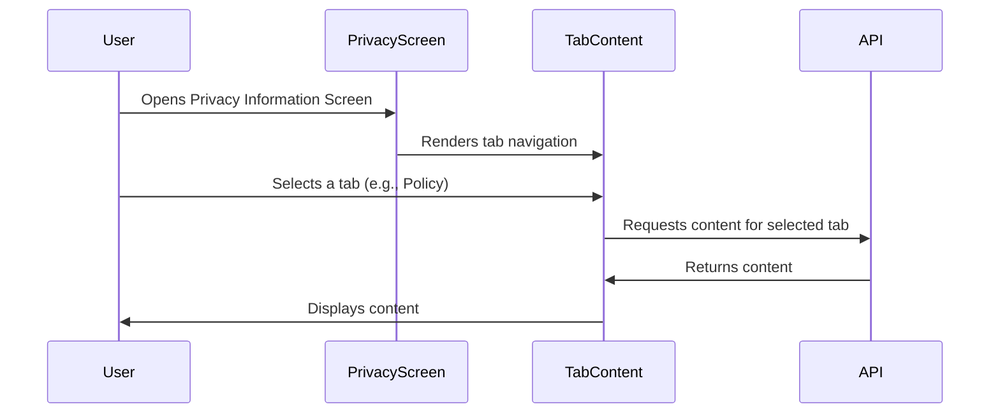
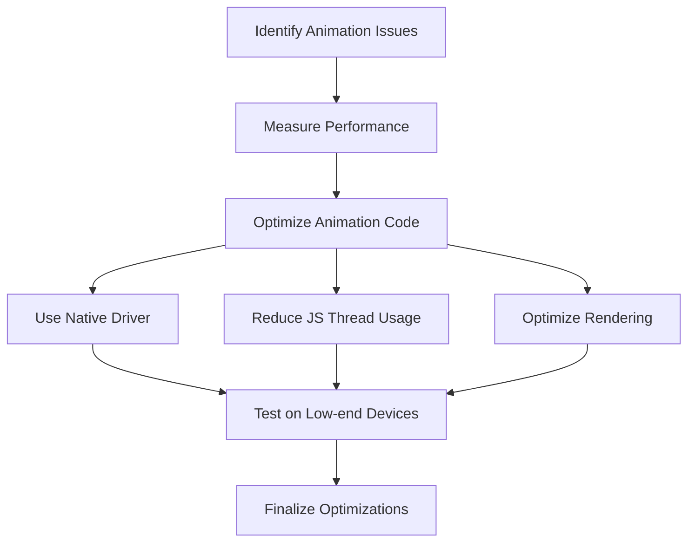
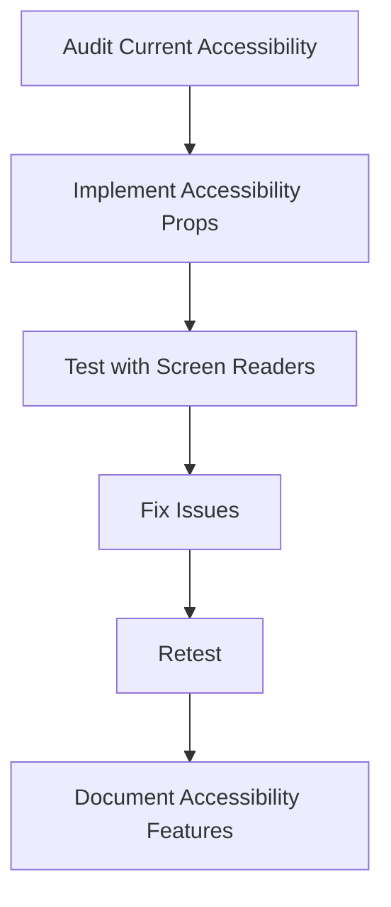
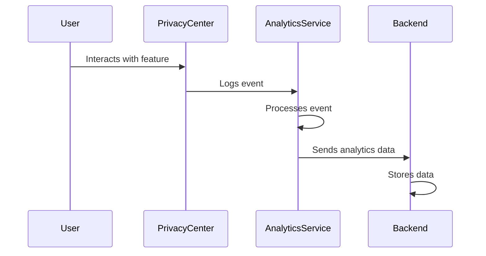
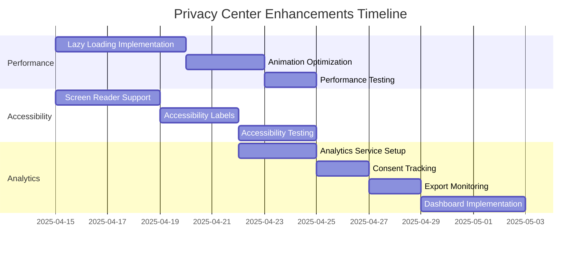

# Privacy Center Enhancements Implementation Plan

This document outlines the detailed implementation plan for the next steps in enhancing the Privacy Center in the 10-Date mobile application. The enhancements focus on three key areas: Performance Optimization, Accessibility Improvements, and Analytics Integration.

## 1. Performance Optimization

### 1.1 Implement Lazy Loading for Privacy Policy Content

#### Approach

The Privacy Information screen currently loads all content at once, which can cause performance issues, especially on lower-end devices. We'll implement lazy loading to improve performance.



#### Implementation Steps

1. **Modify PrivacyInformationScreen.tsx**:
   - Refactor to use React's `lazy` and `Suspense` for tab content
   - Implement tab-specific content loading
   - Add loading indicators for each tab

2. **Create Separate Components for Each Tab**:
   - `PolicyTabContent.tsx`
   - `RightsTabContent.tsx`
   - `FAQTabContent.tsx`
   - `ContactTabContent.tsx`

3. **Implement Content Pagination**:
   - For long content (like Privacy Policy), implement pagination
   - Add "Load More" functionality for FAQ items

4. **Add Content Caching**:
   - Cache loaded content to prevent unnecessary reloading
   - Implement cache invalidation strategy

#### Code Structure

```typescript
// Example structure for lazy loading
import React, { lazy, Suspense } from 'react';

const PolicyTabContent = lazy(() => import('./tabs/PolicyTabContent'));
const RightsTabContent = lazy(() => import('./tabs/RightsTabContent'));
const FAQTabContent = lazy(() => import('./tabs/FAQTabContent'));
const ContactTabContent = lazy(() => import('./tabs/ContactTabContent'));

const renderTabContent = () => {
  switch (activeTab) {
    case PrivacyTab.POLICY:
      return (
        <Suspense fallback={<LoadingIndicator />}>
          <PolicyTabContent />
        </Suspense>
      );
    // Other cases...
  }
};
```

### 1.2 Optimize Animations for Smoother Transitions

#### Approach

The current animations in the Privacy Center can be jerky on some devices. We'll optimize them for smoother transitions.



#### Implementation Steps

1. **Audit Current Animations**:
   - Identify animations that cause performance issues
   - Use React Native Performance Monitor to measure FPS drops

2. **Optimize Tab Indicator Animation**:
   - Convert to use `useNativeDriver: true` where possible
   - Implement hardware acceleration

3. **Optimize List Animations**:
   - Implement windowing for long lists (FlatList optimization)
   - Use `shouldComponentUpdate` or `React.memo` to prevent unnecessary renders

4. **Implement Gesture Handler Optimizations**:
   - Replace standard touch handlers with Gesture Handler for smoother interactions
   - Optimize swipe gestures

#### Code Example

```typescript
// Example of optimized animation
Animated.spring(tabIndicatorPosition, {
  toValue: position,
  useNativeDriver: true,
  tension: 50,
  friction: 7
}).start();

// Example of FlatList optimization
<FlatList
  data={filteredFAQs}
  keyExtractor={(item) => item.id}
  renderItem={renderItem}
  initialNumToRender={5}
  maxToRenderPerBatch={10}
  windowSize={5}
  removeClippedSubviews={true}
/>
```

## 2. Accessibility Improvements

### 2.1 Add Screen Reader Support

#### Approach

Ensure all Privacy Center screens are fully accessible to users with visual impairments by implementing proper screen reader support.



#### Implementation Steps

1. **Audit Current Accessibility**:
   - Use React Native's Accessibility Inspector to identify issues
   - Create a list of elements that need accessibility improvements

2. **Add Accessibility Properties**:
   - Add `accessible` prop to interactive elements
   - Implement `accessibilityLabel` for all UI elements
   - Add `accessibilityHint` for complex interactions
   - Implement `accessibilityRole` for standard UI components

3. **Implement Focus Management**:
   - Ensure logical tab order
   - Add focus indicators for keyboard navigation
   - Implement `accessibilityFocus` where needed

4. **Test with Screen Readers**:
   - Test with VoiceOver (iOS)
   - Test with TalkBack (Android)
   - Document and fix any issues

#### Code Example

```typescript
// Example of accessibility implementation
<TouchableOpacity
  accessible={true}
  accessibilityLabel="Manage your data access and export settings"
  accessibilityHint="Double tap to navigate to data access screen"
  accessibilityRole="button"
  onPress={() => navigation.navigate('DataAccess')}
>
  <Text>Manage Data</Text>
</TouchableOpacity>
```

### 2.2 Implement Accessibility Labels

#### Implementation Steps

1. **Create Consistent Labeling System**:
   - Develop naming conventions for accessibility labels
   - Create helper functions for generating consistent labels

2. **Add Context-Aware Labels**:
   - Ensure labels provide context about the element's purpose
   - Include state information in labels (e.g., "Enabled" or "Disabled")

3. **Implement Dynamic Labels**:
   - Update labels based on component state
   - Ensure labels reflect current content

4. **Document Label Guidelines**:
   - Create documentation for developers on how to maintain accessibility labels
   - Include examples of good and bad labels

#### Code Example

```typescript
// Example of dynamic accessibility labels
<Switch
  value={consent.status}
  onValueChange={handleToggle}
  accessible={true}
  accessibilityLabel={`${consent.title} consent. Currently ${consent.status ? 'enabled' : 'disabled'}`}
  accessibilityRole="switch"
/>
```

### 2.3 Test with Accessibility Tools

#### Implementation Steps

1. **Set Up Automated Testing**:
   - Implement Jest tests with accessibility assertions
   - Add accessibility checks to CI/CD pipeline

2. **Create Accessibility Test Cases**:
   - Develop test scenarios for screen reader navigation
   - Create test cases for keyboard navigation
   - Develop color contrast test cases

3. **Implement Manual Testing Protocol**:
   - Create step-by-step guide for manual accessibility testing
   - Develop checklist for accessibility compliance

4. **Document Testing Results**:
   - Create accessibility compliance report
   - Document any issues and their resolutions

#### Testing Script Example

```typescript
// Example of accessibility test
describe('PrivacyCenterScreen Accessibility', () => {
  it('has proper accessibility labels', () => {
    const { getByText, getAllByRole } = render(<PrivacyCenterScreen />);
    
    const buttons = getAllByRole('button');
    expect(buttons.length).toBeGreaterThan(0);
    
    buttons.forEach(button => {
      expect(button.props.accessibilityLabel).toBeDefined();
      expect(button.props.accessibilityHint).toBeDefined();
    });
  });
});
```

## 3. Analytics Integration

### 3.1 Track Privacy Feature Usage

#### Approach

Implement analytics tracking to understand how users interact with the Privacy Center features.



#### Implementation Steps

1. **Create Analytics Service**:
   - Implement `PrivacyAnalyticsService.ts` to handle privacy-specific events
   - Define event types and parameters

2. **Implement Event Tracking**:
   - Add tracking for screen views
   - Track button clicks and interactions
   - Log feature usage (exports, consent changes, etc.)

3. **Add User Properties**:
   - Track user segments (e.g., privacy-conscious users)
   - Log user preferences anonymously

4. **Implement Privacy-Safe Analytics**:
   - Ensure all tracking is compliant with privacy regulations
   - Implement data anonymization
   - Add user opt-out functionality

#### Code Example

```typescript
// Example of analytics implementation
import AnalyticsService from '../../services/analytics.service';

// In component
const handleDataExport = async () => {
  // Export logic...
  
  // Track the event
  AnalyticsService.trackEvent('privacy_data_export', {
    categories: selectedCategories,
    format: exportFormat,
    anonymized: true // No personal data included
  });
};
```

### 3.2 Measure Consent Change Patterns

#### Implementation Steps

1. **Define Consent Metrics**:
   - Identify key metrics for consent changes
   - Define data structure for consent analytics

2. **Implement Consent Change Tracking**:
   - Add analytics to consent toggle actions
   - Track consent history views
   - Log consent confirmation actions

3. **Create Consent Dashboards**:
   - Design analytics dashboard for consent patterns
   - Implement visualization for consent trends

4. **Set Up Reporting**:
   - Create automated reports for consent changes
   - Implement alerts for unusual patterns

#### Analytics Schema Example

```typescript
// Example of consent change event structure
interface ConsentChangeEvent {
  consentType: string;
  newStatus: boolean;
  previousStatus: boolean;
  timestamp: number;
  userSegment: string; // anonymized user segment
  deviceType: string;
  appVersion: string;
}
```

### 3.3 Monitor Data Export Requests

#### Implementation Steps

1. **Implement Export Request Tracking**:
   - Track export request initiation
   - Log export completion events
   - Monitor export failures

2. **Add Export Analytics Dashboard**:
   - Create visualization for export requests
   - Track export formats and categories
   - Monitor export frequency

3. **Set Up Export Monitoring**:
   - Implement alerts for high export volume
   - Create reports for export patterns
   - Track export performance metrics

4. **Analyze Export Usage**:
   - Identify most commonly exported data categories
   - Track user journey before and after exports
   - Analyze correlation between exports and other actions

#### Monitoring Implementation Example

```typescript
// Example of export monitoring
const monitorExportRequest = async (exportId: string) => {
  try {
    const startTime = Date.now();
    const result = await processExport(exportId);
    const duration = Date.now() - startTime;
    
    AnalyticsService.trackEvent('privacy_export_completed', {
      exportId,
      categories: result.categories,
      format: result.format,
      duration,
      size: result.sizeInKB,
      success: true
    });
    
    return result;
  } catch (error) {
    AnalyticsService.trackEvent('privacy_export_failed', {
      exportId,
      error: error.message,
      success: false
    });
    throw error;
  }
};
```

## Implementation Timeline



## Resource Requirements

- **Development**: 1 Senior React Native Developer, 1 Junior Developer
- **QA**: 1 QA Engineer with accessibility testing experience
- **Design**: Input from UX Designer for accessibility improvements
- **Analytics**: Support from Data Analyst for setting up dashboards

## Success Metrics

- **Performance**: 
  - 50% reduction in initial load time for Privacy Information screen
  - 90% of animations running at 60 FPS on mid-range devices

- **Accessibility**:
  - 100% compliance with WCAG 2.1 AA standards
  - Successful navigation of all screens using screen readers only

- **Analytics**:
  - Complete tracking of all privacy-related user interactions
  - Actionable insights from consent change patterns
  - Early detection of unusual export activity

## Conclusion

This enhancement plan provides a comprehensive approach to improving the Privacy Center implementation in the 10-Date mobile app. By focusing on performance, accessibility, and analytics, we will create a more efficient, inclusive, and data-driven privacy experience for all users.

The implementation follows a phased approach, with each enhancement building on the previous ones. Regular testing and feedback will ensure that the enhancements meet the requirements and provide value to users.