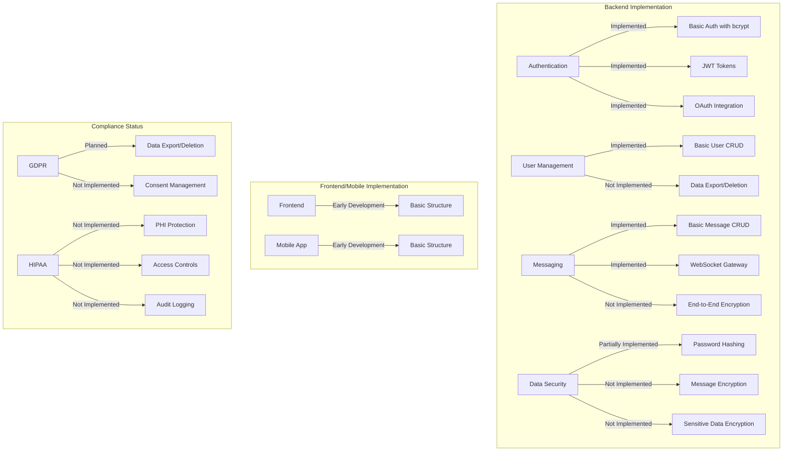
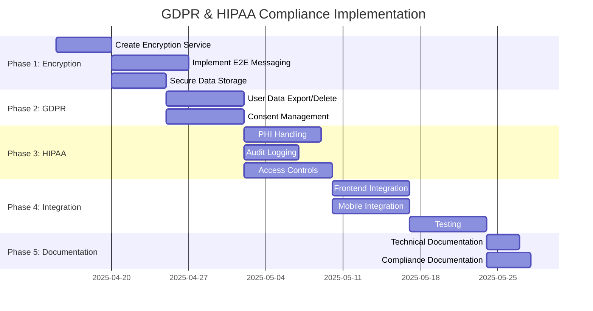
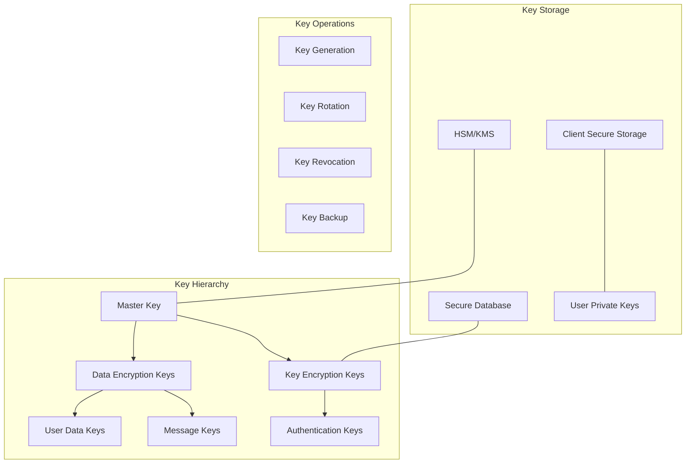

# GDPR and HIPAA Compliance Implementation Plan for 10-Date

This document outlines a comprehensive plan for implementing secure messaging and data storage that meets both GDPR and HIPAA compliance requirements for the 10-Date platform.

## Current State Assessment



## Implementation Plan Overview

### Phase 1: Encryption Infrastructure (2 weeks)
- Create an Encryption Service for field-level encryption
- Implement end-to-end encryption for messages
- Update database entities to store encrypted content

### Phase 2: GDPR Compliance Implementation (2 weeks)
- Implement user data export and deletion functionality
- Create consent management system

### Phase 3: HIPAA Compliance Implementation (3 weeks)
- Implement Protected Health Information (PHI) handling
- Create comprehensive audit logging system
- Develop fine-grained access control system

### Phase 4: Integration and Testing (2 weeks)
- Integrate encryption in frontend and mobile apps
- Conduct security, compliance, and performance testing

### Phase 5: Documentation and Compliance Verification (1 week)
- Create technical and compliance documentation
- Prepare for third-party security audit

## Detailed Implementation Timeline



## Encryption Algorithms and Key Management for HIPAA Compliance

### 1. Encryption Algorithms

For HIPAA-compliant encryption, we'll implement:

#### 1.1 Transport Layer Encryption
- **TLS 1.3** for all API communications
- **Perfect Forward Secrecy (PFS)** to ensure that session keys won't be compromised even if the server's private key is compromised
- **Strong cipher suites** (e.g., TLS_AES_256_GCM_SHA384) with regular rotation

#### 1.2 Data at Rest Encryption
- **AES-256-GCM** (Advanced Encryption Standard with 256-bit key length in Galois/Counter Mode) for database field-level encryption
- **Initialization Vectors (IVs)** stored with each encrypted field to ensure uniqueness
- **Authentication tags** stored to verify data integrity

#### 1.3 End-to-End Message Encryption
- **Signal Protocol** (or similar) for end-to-end encrypted messaging
- **X25519** for key agreement
- **HMAC-SHA256** for message authentication

### 2. Key Management Infrastructure



#### 2.1 Key Hierarchy Implementation
- **Master Key**: Stored in a Hardware Security Module (HSM) or Key Management Service (KMS)
- **Data Encryption Keys (DEKs)**: Unique keys for encrypting different types of data
- **Key Encryption Keys (KEKs)**: Used to encrypt DEKs for secure storage
- **Per-User Keys**: Unique encryption keys for each user's sensitive data

#### 2.2 Key Rotation Policy
- **Master Key**: Rotated annually
- **Data Encryption Keys**: Rotated quarterly
- **User Keys**: Rotated on password change or suspicious activity
- **Session Keys**: New key for each session

#### 2.3 Key Distribution for End-to-End Encryption
- **Asymmetric Key Pairs**: Generated on client devices during registration
- **Public Key Directory**: Server maintains directory of user public keys
- **Key Exchange Protocol**: Signal Protocol's Double Ratchet Algorithm for perfect forward secrecy
- **Out-of-Band Verification**: Optional key verification between users

### 3. Implementation Details

#### 3.1 Backend Encryption Service

```typescript
// src/common/services/encryption.service.ts
@Injectable()
export class EncryptionService {
  constructor(
    @Inject('KMS_PROVIDER') private kmsProvider: KeyManagementProvider,
    @InjectRepository(EncryptionKeyEntity)
    private keyRepository: Repository<EncryptionKeyEntity>,
  ) {}
  
  // Field-level encryption for PHI data
  async encryptPHI(data: string, userId: string): Promise<EncryptedData> {
    // 1. Retrieve or generate data encryption key for user
    const dek = await this.getUserDEK(userId);
    
    // 2. Generate random IV for this encryption operation
    const iv = randomBytes(12); // 96 bits for GCM mode
    
    // 3. Encrypt data using AES-256-GCM
    const cipher = createCipheriv('aes-256-gcm', dek, iv);
    let encrypted = cipher.update(data, 'utf8', 'base64');
    encrypted += cipher.final('base64');
    
    // 4. Get authentication tag
    const authTag = cipher.getAuthTag().toString('base64');
    
    // 5. Return encrypted data with metadata
    return {
      encryptedData: encrypted,
      iv: iv.toString('base64'),
      authTag,
      algorithm: 'AES-256-GCM',
      keyId: await this.getKeyIdentifier(userId),
    };
  }
  
  async decryptPHI(encryptedData: EncryptedData, userId: string): Promise<string> {
    // Implementation of decryption using the same key and parameters
  }
  
  // Key management methods
  private async getUserDEK(userId: string): Promise<Buffer> {
    // Retrieve user's DEK, decrypting it with the master key if needed
  }
  
  async rotateUserKeys(userId: string): Promise<void> {
    // Generate new keys and re-encrypt user data
  }
  
  async backupUserKeys(userId: string): Promise<void> {
    // Create secure backup of user keys
  }
}
```

#### 3.2 Database Schema for Key Management

```typescript
// src/common/entities/encryption-key.entity.ts
@Entity('encryption_keys')
export class EncryptionKeyEntity {
  @PrimaryGeneratedColumn('uuid')
  id: string;
  
  @Column({ type: 'uuid' })
  userId: string;
  
  @Column()
  keyType: 'DEK' | 'KEK' | 'AUTH';
  
  @Column({ type: 'text' })
  encryptedKey: string; // Key encrypted with master key
  
  @Column({ type: 'text' })
  iv: string;
  
  @Column()
  algorithm: string;
  
  @Column()
  createdAt: Date;
  
  @Column({ nullable: true })
  rotatedAt: Date;
  
  @Column({ default: true })
  active: boolean;
}
```

### 4. Client-Side Key Management

#### 4.1 Mobile App Implementation

```typescript
// src/services/encryption.service.ts (React Native)
export class ClientEncryptionService {
  // Secure storage for keys using Keychain/Keystore
  private async storePrivateKey(key: string): Promise<void> {
    await Keychain.setGenericPassword(
      'private_key',
      key,
      {
        accessControl: Keychain.ACCESS_CONTROL.BIOMETRY_ANY_OR_DEVICE_PASSCODE,
        accessible: Keychain.ACCESSIBLE.WHEN_UNLOCKED_THIS_DEVICE_ONLY,
      }
    );
  }
  
  // Generate key pair for E2E messaging
  async generateKeyPair(): Promise<{publicKey: string, privateKey: string}> {
    // Use native modules for secure key generation
    // Register public key with server
  }
  
  // Encrypt message for recipient
  async encryptMessage(message: string, recipientPublicKey: string): Promise<EncryptedMessage> {
    // Implement Signal Protocol encryption
  }
}
```

### 5. HIPAA-Specific Security Measures

#### 5.1 Access Controls
- **Role-Based Access Control (RBAC)** with principle of least privilege
- **Contextual access policies** based on user relationship, time, and location
- **Break-glass procedures** for emergency access with full audit trail

#### 5.2 Comprehensive Audit Logging
- **Immutable logs** of all PHI access, including:
  - Who accessed the data
  - What data was accessed
  - When it was accessed
  - From where it was accessed
  - Why it was accessed (reason codes)

#### 5.3 Key Custody and Recovery
- **M-of-N threshold scheme** for master key recovery
- **Secure key escrow** for regulatory compliance
- **Documented key recovery procedures** with multi-person authorization

## GDPR Compliance Implementation

### 1. User Data Management

```typescript
// src/user/services/data-management.service.ts
@Injectable()
export class DataManagementService {
  async exportUserData(userId: string): Promise<UserDataExport> {
    // Collect and format all user data
    // Include messages, profile info, preferences, etc.
  }
  
  async deleteUserData(userId: string, options: DeletionOptions): Promise<void> {
    // Implement complete or partial data deletion
    // Handle cascading deletes or anonymization
  }
}
```

### 2. Consent Management

```typescript
// src/user/entities/user-consent.entity.ts
@Entity('user_consents')
export class UserConsentEntity {
  @PrimaryGeneratedColumn('uuid')
  id: string;
  
  @Column({ type: 'uuid' })
  userId: string;
  
  @Column()
  consentType: string; // e.g., 'data_processing', 'marketing', etc.
  
  @Column()
  granted: boolean;
  
  @Column()
  timestamp: Date;
  
  @Column({ type: 'text', nullable: true })
  ipAddress: string;
  
  @Column({ type: 'text', nullable: true })
  userAgent: string;
}
```

## Resource Requirements

- **Backend Developer with Security Expertise**: Implement encryption services and HIPAA compliance
- **Frontend Developer**: Implement client-side encryption and user interfaces
- **Mobile Developer**: Implement mobile app encryption and security features
- **Security Specialist**: Review implementation and conduct security testing
- **Compliance Specialist**: Verify GDPR and HIPAA compliance requirements

## Next Steps

1. Set up the encryption service infrastructure
2. Modify the message entity and service to support encrypted content
3. Implement client-side encryption in the frontend and mobile app
4. Develop the data export and deletion functionality for GDPR compliance
5. Implement the audit logging system for HIPAA compliance