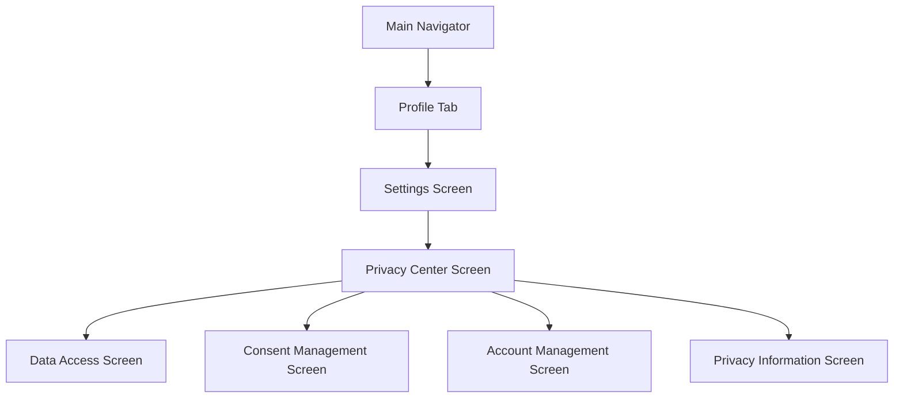

# Mobile Privacy Center Implementation Plan

## Overview

This document outlines the plan for implementing the Privacy Center in the 10-Date mobile application. The implementation will focus on creating mobile-optimized versions of the web Privacy Center screens, adding biometric authentication for critical actions, and implementing share functionality for data exports.

## Architecture

The Privacy Center will be integrated into the existing mobile app architecture as follows:



The Privacy Center will be accessible from the Settings screen, which is already part of the app's navigation structure. Each section of the Privacy Center will be implemented as a separate screen to maintain a clean and focused user experience on mobile devices.

## Implementation Details

### 1. Navigation Structure

We'll update the navigation types and structure to include the Privacy Center screens:

```typescript
// Update StackParamList in navigation.ts
export type StackParamList = {
  // Existing screens...
  PrivacyCenter: undefined;
  DataAccess: undefined;
  ConsentManagement: undefined;
  AccountManagement: undefined;
  PrivacyInformation: undefined;
};

// Update MainNavigator in navigation/index.tsx
const MainNavigator = () => {
  return (
    <Stack.Navigator screenOptions={{ headerShown: false }}>
      {/* Existing screens... */}
      <Stack.Screen name="PrivacyCenter" component={PrivacyCenterScreen} />
      <Stack.Screen name="DataAccess" component={DataAccessScreen} />
      <Stack.Screen name="ConsentManagement" component={ConsentManagementScreen} />
      <Stack.Screen name="AccountManagement" component={AccountManagementScreen} />
      <Stack.Screen name="PrivacyInformation" component={PrivacyInformationScreen} />
    </Stack.Navigator>
  );
};
```

### 2. Screen Components

#### 2.1 Privacy Center Main Screen

The main Privacy Center screen will serve as a hub for accessing the different privacy features:

```typescript
// src/screens/privacy/PrivacyCenterScreen.tsx
import React from 'react';
import { View, Text, StyleSheet, ScrollView } from 'react-native';
import { Card, Button, Icon } from 'react-native-elements';
import { useNavigation } from '@react-navigation/native';
import { StackNavigationProp } from '@react-navigation/stack';
import { StackParamList } from '../../types/navigation';

type PrivacyCenterNavigationProp = StackNavigationProp<StackParamList, 'PrivacyCenter'>;

const PrivacyCenterScreen = () => {
  const navigation = useNavigation<PrivacyCenterNavigationProp>();

  return (
    <ScrollView style={styles.container}>
      <Text style={styles.title}>Privacy Center</Text>
      <Text style={styles.subtitle}>Manage your privacy settings and data</Text>
      
      {/* Data Access Card */}
      <Card containerStyle={styles.card}>
        <Card.Title>Data Access & Export</Card.Title>
        <Card.Divider />
        <Text style={styles.cardText}>
          Access and export your personal data in various formats
        </Text>
        <Button
          icon={<Icon name="download" type="feather" color="#fff" />}
          title="Manage Data"
          onPress={() => navigation.navigate('DataAccess')}
          buttonStyle={styles.button}
        />
      </Card>
      
      {/* Consent Management Card */}
      <Card containerStyle={styles.card}>
        <Card.Title>Consent Management</Card.Title>
        <Card.Divider />
        <Text style={styles.cardText}>
          Control how your data is used and processed
        </Text>
        <Button
          icon={<Icon name="check-circle" type="feather" color="#fff" />}
          title="Manage Consent"
          onPress={() => navigation.navigate('ConsentManagement')}
          buttonStyle={styles.button}
        />
      </Card>
      
      {/* Account Management Card */}
      <Card containerStyle={styles.card}>
        <Card.Title>Account Management</Card.Title>
        <Card.Divider />
        <Text style={styles.cardText}>
          Delete or anonymize your account and data
        </Text>
        <Button
          icon={<Icon name="user-x" type="feather" color="#fff" />}
          title="Manage Account"
          onPress={() => navigation.navigate('AccountManagement')}
          buttonStyle={styles.button}
        />
      </Card>
      
      {/* Privacy Information Card */}
      <Card containerStyle={styles.card}>
        <Card.Title>Privacy Information</Card.Title>
        <Card.Divider />
        <Text style={styles.cardText}>
          Learn about our privacy practices and your rights
        </Text>
        <Button
          icon={<Icon name="info" type="feather" color="#fff" />}
          title="View Information"
          onPress={() => navigation.navigate('PrivacyInformation')}
          buttonStyle={styles.button}
        />
      </Card>
    </ScrollView>
  );
};

const styles = StyleSheet.create({
  container: {
    flex: 1,
    backgroundColor: '#f5f5f5',
    padding: 10,
  },
  title: {
    fontSize: 24,
    fontWeight: 'bold',
    marginTop: 20,
    marginBottom: 5,
    marginLeft: 10,
  },
  subtitle: {
    fontSize: 16,
    color: '#666',
    marginBottom: 20,
    marginLeft: 10,
  },
  card: {
    borderRadius: 10,
    marginBottom: 15,
  },
  cardText: {
    marginBottom: 15,
  },
  button: {
    backgroundColor: '#FF006E',
    borderRadius: 5,
  },
});

export default PrivacyCenterScreen;
```

#### 2.2 Data Access Screen

The Data Access screen will allow users to request and download their data:

```typescript
// Key features to implement:
// - Data category selection (checkboxes)
// - Export format selection (dropdown)
// - Request data export button
// - Export history list with status indicators
// - Share functionality for completed exports
// - Pull-to-refresh for export status updates
```

#### 2.3 Consent Management Screen

The Consent Management screen will allow users to manage their consent preferences:

```typescript
// Key features to implement:
// - Toggle switches for each consent type
// - Confirmation dialogs for consent changes
// - Detailed descriptions for each consent type
// - History button for each consent type
// - History modal with timeline of consent changes
```

#### 2.4 Account Management Screen

The Account Management screen will allow users to delete or anonymize their account:

```typescript
// Key features to implement:
// - Option selection (anonymize vs. delete)
// - Data selection checkboxes
// - Reason selection radio buttons
// - Feedback text input
// - Multi-step confirmation process
// - Biometric authentication for final confirmation
```

#### 2.5 Privacy Information Screen

The Privacy Information screen will provide educational content about privacy:

```typescript
// Key features to implement:
// - Tab navigation for different sections
// - Privacy policy viewer
// - Your rights information
// - Searchable FAQ section
// - Support contact information
```

### 3. Biometric Authentication Integration

We'll leverage the existing biometric authentication capabilities in the app to add an extra layer of security for critical privacy actions:

```typescript
// Example implementation for account deletion confirmation
import TouchID from 'react-native-touch-id';
import AuthService from '../../services/auth.service';

const confirmAccountDeletion = async () => {
  try {
    // Check if biometrics is available
    const biometricsAvailable = await AuthService.isBiometricsAvailable();
    
    if (biometricsAvailable) {
      // Configure authentication prompt
      const authConfig = {
        title: 'Confirm Account Deletion', 
        color: '#FF006E',
        sensorErrorDescription: 'Authentication failed'
      };
      
      // Trigger biometric authentication
      await TouchID.authenticate('Please authenticate to confirm account deletion', authConfig);
      
      // Proceed with account deletion after successful authentication
      await deleteAccount();
    } else {
      // Fall back to password confirmation if biometrics is not available
      setShowPasswordConfirmation(true);
    }
  } catch (error) {
    console.error('Biometric authentication failed:', error);
    // Handle authentication failure
    Alert.alert('Authentication Failed', 'Please try again or use password confirmation.');
  }
};
```

### 4. Share Functionality for Exports

We'll implement the ability to share exported data using the React Native Share API:

```typescript
// Example implementation for sharing exported data
import { Share } from 'react-native';
import * as FileSystem from 'expo-file-system';

const shareExport = async (exportUrl: string, fileName: string) => {
  try {
    // Download the file to local filesystem
    const localUri = FileSystem.documentDirectory + fileName;
    const { uri } = await FileSystem.downloadAsync(exportUrl, localUri);
    
    // Share the file
    await Share.share({
      url: uri,
      title: 'My 10-Date Data Export',
      message: 'Here is my exported data from 10-Date',
    });
  } catch (error) {
    console.error('Error sharing export:', error);
    Alert.alert('Sharing Failed', 'Unable to share the export. Please try again.');
  }
};
```

### 5. API Integration

We'll create a service to handle API calls to the backend for privacy-related operations:

```typescript
// src/services/privacy.service.ts
import axios from 'axios';
import { API_URL } from '../config';
import AuthService from './auth.service';

// Create API client with authentication
const privacyApi = axios.create({
  baseURL: `${API_URL}/user`,
  headers: {
    'Content-Type': 'application/json',
  },
});

// Add auth token to requests
privacyApi.interceptors.request.use(async (config) => {
  const token = await AuthService.getAccessToken();
  if (token) {
    config.headers.Authorization = `Bearer ${token}`;
  }
  return config;
});

// Data export functions
export const requestDataExport = async (categories: Record<string, boolean>, format: string) => {
  const response = await privacyApi.post('/data/export/request', { categories, format });
  return response.data;
};

export const getExportRequests = async () => {
  const response = await privacyApi.get('/data/export/requests');
  return response.data;
};

export const getExportRequest = async (exportId: string) => {
  const response = await privacyApi.get(`/data/export/requests/${exportId}`);
  return response.data;
};

// Consent management functions
export const getConsentPreferences = async () => {
  const response = await privacyApi.get('/consent');
  return response.data;
};

export const updateConsentPreference = async (
  consentType: string,
  status: boolean,
  notes?: string
) => {
  const response = await privacyApi.put(`/consent/${consentType}`, { status, notes });
  return response.data;
};

export const getConsentHistory = async (consentType?: string) => {
  const url = consentType ? `/consent/history/${consentType}` : '/consent/history';
  const response = await privacyApi.get(url);
  return response.data;
};

// Account management functions
export const deleteAccount = async (options: {
  anonymize: boolean;
  deleteMessages: boolean;
  deleteMatches: boolean;
  deletePayments: boolean;
  deleteConsent: boolean;
  reason: string;
  feedback?: string;
}) => {
  const response = await privacyApi.post('/data/delete', options);
  return response.data;
};

export default {
  requestDataExport,
  getExportRequests,
  getExportRequest,
  getConsentPreferences,
  updateConsentPreference,
  getConsentHistory,
  deleteAccount,
};
```

## Implementation Phases

### Phase 1: Navigation and Base Screens (1 week)

1. Update navigation types and structure
2. Create the main Privacy Center screen
3. Create skeleton screens for each section
4. Implement navigation between screens

### Phase 2: Data Access Implementation (1 week)

1. Implement data category selection UI
2. Implement export format selection
3. Implement export request functionality
4. Create export history list
5. Implement pull-to-refresh for status updates
6. Add share functionality for completed exports

### Phase 3: Consent Management Implementation (1 week)

1. Implement consent toggle UI
2. Create confirmation dialogs
3. Implement consent update functionality
4. Create consent history modal
5. Implement history viewing functionality

### Phase 4: Account Management Implementation (1 week)

1. Implement option selection UI
2. Create multi-step confirmation process
3. Implement reason selection and feedback collection
4. Integrate biometric authentication
5. Implement account deletion/anonymization functionality

### Phase 5: Privacy Information Implementation (3 days)

1. Implement tab navigation
2. Create privacy policy viewer
3. Implement rights information section
4. Create searchable FAQ section
5. Implement support contact section

### Phase 6: Testing and Refinement (1 week)

1. Write unit tests for all components
2. Perform integration testing
3. Conduct usability testing
4. Fix bugs and refine UI/UX
5. Optimize performance

## Technical Considerations

### Biometric Authentication

- Use the existing `TouchID` implementation from `auth.service.ts`
- Implement biometric confirmation for:
  - Account deletion/anonymization
  - Consent changes for sensitive data processing
  - Exporting sensitive data categories

### Data Sharing

- Use React Native's Share API for sharing exported data
- Support sharing via:
  - Email
  - Messaging apps
  - Cloud storage services
  - AirDrop (iOS)
  - Nearby Share (Android)

### Mobile-Specific UI Considerations

- Use native components from React Native Elements
- Implement swipe gestures for navigation
- Use bottom sheets for modals on mobile
- Ensure all touch targets are at least 44x44 points
- Optimize for both portrait and landscape orientations
- Support dark mode

### Accessibility

- Implement proper accessibility labels
- Support screen readers
- Ensure sufficient color contrast
- Support dynamic text sizes

## Questions for Consideration

1. Should we implement offline support for viewing privacy settings?
2. How should we handle large data exports on mobile devices with limited storage?
3. Should we implement push notifications for export completion?
4. How should we handle biometric authentication failures?
5. Should we implement a simplified version of the Privacy Center for the mobile app?

## Next Steps

1. Review and finalize this implementation plan
2. Set up the project structure and navigation
3. Begin implementation of the main Privacy Center screen
4. Implement each section screen according to the phased approach
5. Conduct testing and refinement

Would you like to make any changes or additions to this plan?