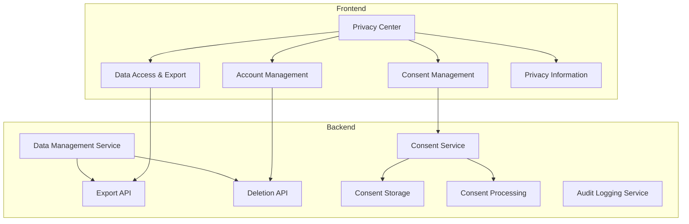

# Privacy Center Implementation Plan

## Overview

The Privacy Center will be a dedicated section in both the web and mobile applications that provides users with a centralized location to manage their privacy preferences and exercise their GDPR rights. This implementation builds upon our existing GDPR compliance backend services and encryption infrastructure.

## Key Features

1. **Data Access & Export**
   - View personal data by category
   - Download data in multiple formats (JSON, CSV, PDF)
   - Track export history
   - Request specific data categories

2. **Consent Management**
   - View and modify consent preferences
   - Granular control over data processing activities
   - Consent history timeline
   - Clear explanations of data usage

3. **Account Management**
   - Account deletion workflow
   - Account anonymization option
   - Data retention controls
   - Feedback collection for deletion reasons

4. **Privacy Information**
   - Privacy policy viewer
   - FAQ section about data handling
   - Educational content about privacy rights
   - Support contact options

## Architecture and Components



## Implementation Plan

### Phase 1: Backend Enhancements (1-2 weeks)

1. **Create Consent Management API**
   - Develop a consent management service
   - Create database schema for storing user consent preferences
   - Implement API endpoints for managing consent
   - Add audit logging for consent changes

   **Key Endpoints:**
   - `GET /api/user/consent` - Get all user consent preferences
   - `GET /api/user/consent/:type` - Get specific consent preference
   - `PUT /api/user/consent/:type` - Update consent preference
   - `GET /api/user/consent/history` - Get consent change history

2. **Enhance Data Management API**
   - Add endpoints for granular data access (specific data categories)
   - Implement data format options (JSON, CSV, PDF)
   - Add progress tracking for large data exports

   **Key Endpoints:**
   - `GET /api/user/data/categories` - Get available data categories
   - `GET /api/user/data/export/:category` - Export specific data category
   - `GET /api/user/data/export/:category/:format` - Export in specific format
   - `GET /api/user/data/export/status/:id` - Check export status

### Phase 2: Web Frontend Implementation (2-3 weeks)

1. **Privacy Center Dashboard**
   - Create a new page accessible from user profile
   - Design a dashboard layout with cards for each privacy feature
   - Implement navigation between privacy features

   **Components:**
   - `PrivacyCenterPage.tsx` - Main container
   - `PrivacyFeatureCard.tsx` - Reusable card component
   - `PrivacyNavigation.tsx` - Navigation component

2. **Data Access & Export UI**
   - Create a data category selection interface
   - Implement data preview functionality
   - Add download options with different formats
   - Show export history

   **Components:**
   - `DataAccessPanel.tsx` - Main container
   - `DataCategorySelector.tsx` - Category selection
   - `DataPreviewTable.tsx` - Data preview
   - `ExportOptionsForm.tsx` - Format selection
   - `ExportHistoryList.tsx` - History display

3. **Consent Management UI**
   - Create toggles for different consent categories
   - Implement consent history view
   - Add explanations for each consent type
   - Create confirmation dialogs for consent changes

   **Components:**
   - `ConsentManagementPanel.tsx` - Main container
   - `ConsentToggle.tsx` - Toggle with explanation
   - `ConsentHistoryTimeline.tsx` - History view
   - `ConsentConfirmationDialog.tsx` - Confirmation dialog

4. **Account Management UI**
   - Create account deletion workflow with confirmation steps
   - Implement anonymization option
   - Add explanations of the implications of each action
   - Include feedback collection for deletion reasons

   **Components:**
   - `AccountManagementPanel.tsx` - Main container
   - `DeletionWorkflow.tsx` - Step-by-step process
   - `AnonymizationForm.tsx` - Anonymization options
   - `FeedbackForm.tsx` - Reason collection

5. **Privacy Information Section**
   - Create privacy policy viewer
   - Add FAQ section about data handling
   - Include educational content about privacy rights

   **Components:**
   - `PrivacyInformationPanel.tsx` - Main container
   - `PolicyViewer.tsx` - Policy display
   - `PrivacyFAQ.tsx` - Accordion FAQ
   - `PrivacyEducation.tsx` - Educational content

### Phase 3: Mobile App Implementation (2-3 weeks)

1. **Privacy Center Screen**
   - Create a new screen in the profile section
   - Design a mobile-friendly layout
   - Implement navigation between privacy features

   **Components:**
   - `PrivacyCenterScreen.tsx` - Main container
   - `PrivacyFeatureCard.tsx` - Mobile card component
   - `PrivacyTabNavigation.tsx` - Tab-based navigation

2. **Data Access & Export UI**
   - Adapt web UI for mobile form factor
   - Optimize for touch interactions
   - Implement share functionality for exports
   - Add local storage options

   **Components:**
   - `DataAccessScreen.tsx` - Main container
   - `DataCategoryList.tsx` - Mobile category selection
   - `ExportOptionsScreen.tsx` - Format selection
   - `ShareExportSheet.tsx` - Share functionality

3. **Consent Management UI**
   - Create mobile-optimized toggles
   - Implement simplified consent history
   - Add educational tooltips

   **Components:**
   - `ConsentManagementScreen.tsx` - Main container
   - `ConsentToggleList.tsx` - List of toggles
   - `ConsentHistoryScreen.tsx` - History view
   - `ConsentInfoModal.tsx` - Educational content

4. **Account Management UI**
   - Create streamlined deletion workflow
   - Implement biometric confirmation for critical actions
   - Add offline support for deletion requests

   **Components:**
   - `AccountManagementScreen.tsx` - Main container
   - `DeletionStepsScreen.tsx` - Step-by-step process
   - `BiometricConfirmation.tsx` - Secure confirmation
   - `OfflineDeletionRequest.tsx` - Offline support

5. **Privacy Information Section**
   - Create mobile-optimized policy viewer
   - Add searchable FAQ
   - Include quick links to support

   **Components:**
   - `PrivacyInformationScreen.tsx` - Main container
   - `PolicyViewerScreen.tsx` - Policy display
   - `SearchableFAQ.tsx` - Searchable FAQ
   - `SupportLinkList.tsx` - Quick links

### Phase 4: Testing and Refinement (1-2 weeks)

1. **Usability Testing**
   - Conduct user testing sessions
   - Gather feedback on UI/UX
   - Identify pain points and areas for improvement

2. **Accessibility Review**
   - Ensure WCAG compliance
   - Test with screen readers
   - Verify keyboard navigation

3. **Performance Optimization**
   - Optimize data loading
   - Implement pagination for large datasets
   - Add caching where appropriate

4. **Security Review**
   - Conduct security audit
   - Verify authentication for sensitive operations
   - Test encryption of exported data

## UI/UX Design Guidelines

1. **Clarity and Transparency**
   - Use clear, jargon-free language
   - Explain implications of privacy choices
   - Provide context for data usage

2. **User Control**
   - Make privacy controls easily accessible
   - Provide granular options where appropriate
   - Allow easy reversal of decisions

3. **Progressive Disclosure**
   - Present essential information first
   - Provide details on demand
   - Use tooltips and expandable sections

4. **Consistency**
   - Maintain consistent UI patterns
   - Use familiar interaction models
   - Align with platform conventions

5. **Feedback and Confirmation**
   - Confirm important actions
   - Provide clear feedback on changes
   - Show success/error states

## Database Schema Enhancements

### Consent Table
```
consent_preferences
- id: UUID (PK)
- user_id: UUID (FK to users)
- consent_type: ENUM (marketing, analytics, third_party, etc.)
- status: BOOLEAN
- created_at: TIMESTAMP
- updated_at: TIMESTAMP
```

### Consent History Table
```
consent_history
- id: UUID (PK)
- user_id: UUID (FK to users)
- consent_type: ENUM (marketing, analytics, third_party, etc.)
- status: BOOLEAN
- changed_at: TIMESTAMP
- ip_address: VARCHAR
- user_agent: VARCHAR
```

### Data Export Table
```
data_exports
- id: UUID (PK)
- user_id: UUID (FK to users)
- status: ENUM (pending, processing, completed, failed)
- format: ENUM (json, csv, pdf)
- categories: JSONB
- created_at: TIMESTAMP
- completed_at: TIMESTAMP
- download_url: VARCHAR
- expires_at: TIMESTAMP
```

## Timeline and Resources

**Total Estimated Time**: 6-10 weeks

**Resource Requirements**:
- 1-2 Backend Developers
- 1-2 Frontend Developers
- 1 Mobile Developer
- 1 UI/UX Designer
- QA Support

**Key Milestones**:
1. Backend API Completion - End of Phase 1
2. Web Frontend MVP - End of Phase 2
3. Mobile App MVP - End of Phase 3
4. Production Release - End of Phase 4

## Risks and Mitigations

1. **Risk**: Complex privacy settings may confuse users
   **Mitigation**: User testing, progressive disclosure, clear explanations

2. **Risk**: Performance issues with large data exports
   **Mitigation**: Asynchronous processing, progress indicators, chunked downloads

3. **Risk**: Regulatory compliance gaps
   **Mitigation**: Legal review, compliance checklist, regular audits

4. **Risk**: Security vulnerabilities in privacy features
   **Mitigation**: Security review, penetration testing, encryption of sensitive data

5. **Risk**: User resistance to consent management
   **Mitigation**: Clear value proposition, educational content, streamlined UI

## Next Steps

1. Finalize UI/UX designs for Privacy Center
2. Set up project tracking in JIRA
3. Create development branches
4. Begin backend implementation
5. Schedule regular progress reviews